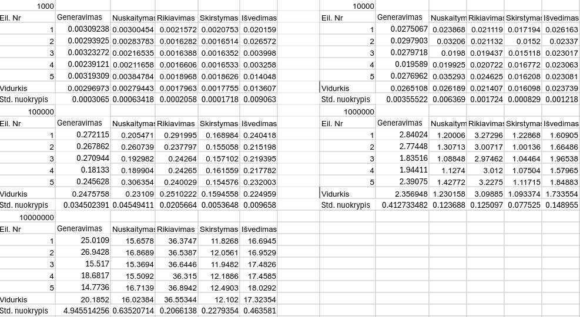
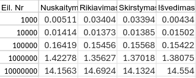
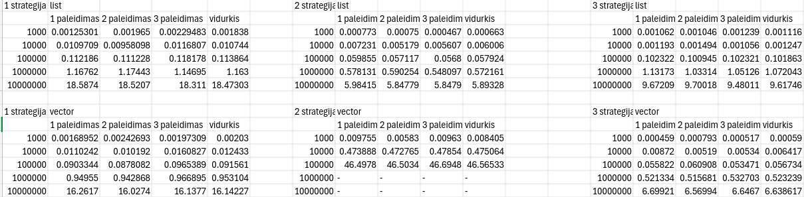

# Objektinio programavimo (IND studijos)  1 užduotis

## Instaliavimas ir paleidimas

Instaliuoti galima su `git clone` komanda: .
Paleisdimui naudojamas `cmake`. 
Kompiliavimui užtenka paleisti `run.sh`.
Sukompiliavimus executable `main` bus direktorijoje `build` todėl Unix sistemose reikia paleisti `./build/main`.

## v0.1
---
### Studentų duomenų bazė:
- Duomenys saugomi struktūroje `Studentas`
- Galutinis pažymys skaičiuojamas pagal formulę: *0.4 * namų darbų pažymys + 0.6 * egzamino pažymys*.
- Galima studentus nuskaityti iš konsolės, iš failo ar sugeneruoti atsitiktinai.
- Išvedus studentai yra išrikiuoti.

## v0.2
---
- Pridėtas skirstymas į dvi kategorijas: vargšai ir galvos.
- Atlikti matavimai.

#### Rezultatai su `std::vector`

#### Išvada: visų algoritmų greičiai yra $O(n)$, o rikiavimas, asimptotiškai, lėtesnis $O(nlogn)$

## v0.3
---
- Realizuotos funkcijos su šablonais ir išmatuoti `std::list` greičiai.

#### Rezultatai su `std::list`

> Kompiuteris: intecl Core i7-4800MQ (max freq. 3.7 GHz), 16 Gb ram

## v1.0
---
- Realizuotos skirstymo strategijos.

#### Išvada: 2 strategija su `std::vector` nes jos greitis, asimptotiškai yra $O(n)$. Tuo tarpu, greičiausiai veikia 3 strategija, nes naudotos optimzuotos funkcijos iš STL.
