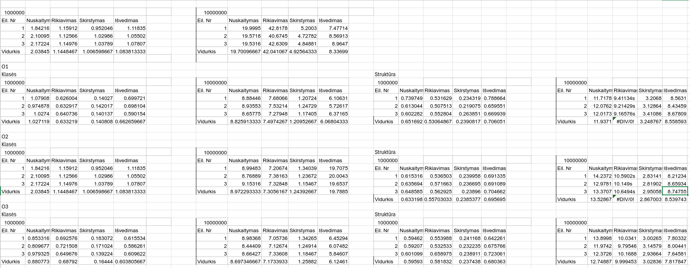

# Objektinio programavimo (IND studijos)  2 užduotis

## Instaliavimas ir paleidimas Unix sistemose

Instaliavus su `git clone` pradinio kompiliavimo veiksmai:

```
mkdir build
./run.sh
```

Vėliau leidžiant programą, pirmosios eilutės nebereikės.

CLI pasirinkimai (flagai po `./run.sh`):
| Flag'as | Pasirinkimas |
| ------- | ------------ |
| -t | Paleisti testus pradžioje |
| -r | Paleisti be testų |
| (nėra flag'ų) | Kompiliuoti |


## v0.1
---
### Studentų duomenų bazė:
- Duomenys saugomi struktūroje `Studentas`
- Galutinis pažymys skaičiuojamas pagal formulę: *0.4 * namų darbų pažymys + 0.6 * egzamino pažymys*.
- Galima studentus nuskaityti iš konsolės, iš failo ar sugeneruoti atsitiktinai.
- Išvedus studentai yra išrikiuoti.

## v0.2
---
- Pridėtas skirstymas į dvi kategorijas: vargšai ir galvos.
- Atlikti matavimai.

#### Rezultatai su `std::vector`


#### Išvada: visų algoritmų greičiai yra $O(n)$, o rikiavimas, asimptotiškai, lėtesnis $O(nlogn)$


## v0.3
---
- Realizuotos funkcijos su šablonais ir išmatuoti `std::list` greičiai.

#### Rezultatai su `std::list`


> Kompiuteris: intecl Core i7-4800MQ (max freq. 3.7 GHz), 16 Gb ram

## v1.0
---
- Realizuotos skirstymo strategijos.


#### Išvada: 2 strategija su `std::vector` nes jos greitis, asimptotiškai yra $O(n)$. Tuo tarpu, greičiausiai veikia 3 strategija, nes naudotos optimzuotos funkcijos iš STL.


## v1.1

- Realizuota su klasėmis.
- Padaryti matavimai su įvairiais compiler flagais.

### Matavimo rezultatai

Failo dydžiai:

| Optimizavimo lygis | Failo dydis (baitais) |
| ------------------ | --------------------- |
| O1 | 200904 |
| O2 | 203160 |
| O3 | 210784 |



## v1.2

- Realizuoti "Rule of three" metodai".

## v1.5

- Sukurta `Zmogus` abstrakti klasė.

## v2.0

- Sugeneruota dokumentacija su doxygen.
- Parašyti unittestai su `doctest`
  1. Testuojamas galutinio pažymio skaičiavimas.
  2. Testuojamas kategorizavimas.